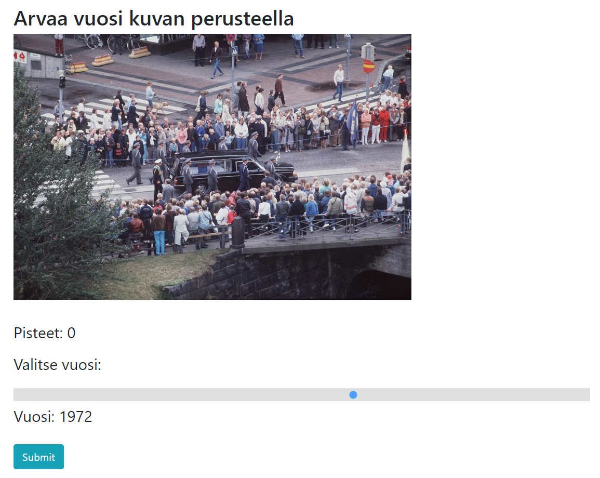

# Guess the year based on the picture

## Inspired by Chronophoto

Game app that shows you a series of photos and you will have to guess what year each one was taken. There's a (customizable) amount of photos per round and you will be scored based on how far or close you guessed. 

Technologies: Jquery, Bootstrap

All the elements are loaded in at the start, the scripts just hide or show elements accordingly, giving the appearance of a seamless SPA. 

May or may not be deployed at [here](https://sampsale.github.io/PhotoApp/). 

